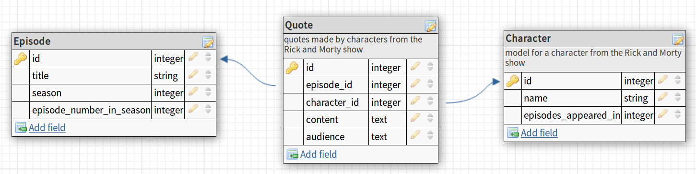

# CoderAcademy task - create a simple ruby app
## Rick and Morty quotes aggregator

### Initial ERD
The initial entity diagram we made looked like this:

Where it was later revised is the Character model had its *episodes_appeared_in* attribute removed as that is conveyed through the quote relationship as Character *has many* Episodes *through* Quote.
